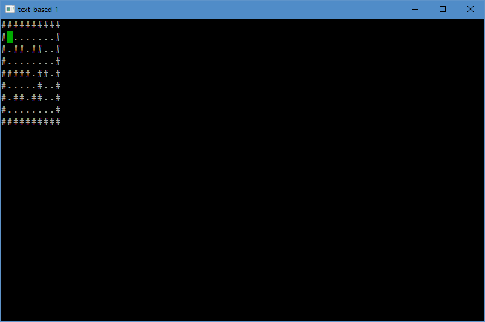
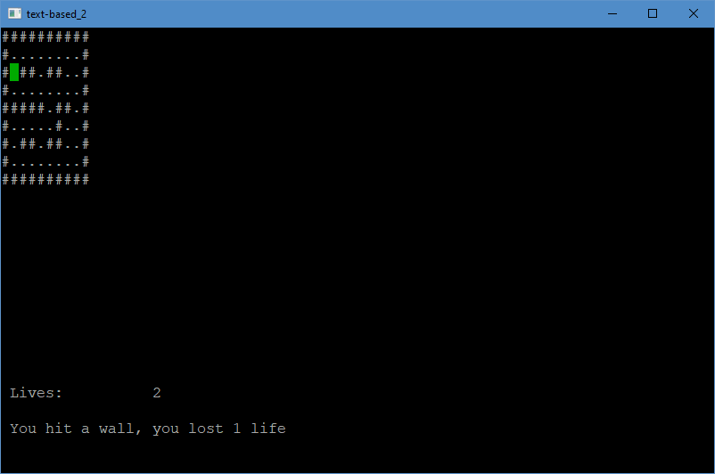
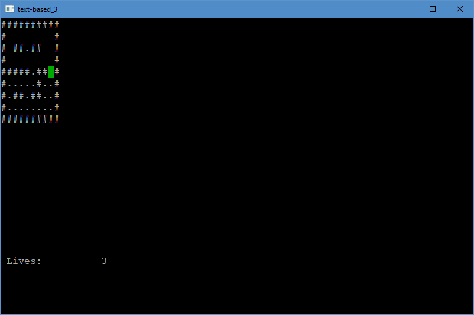
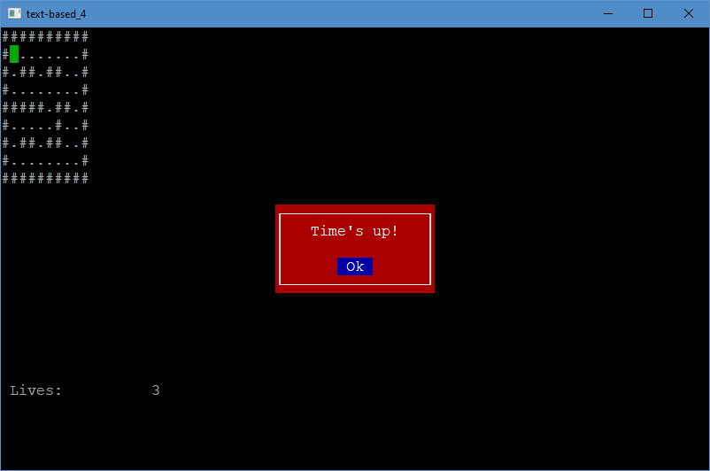
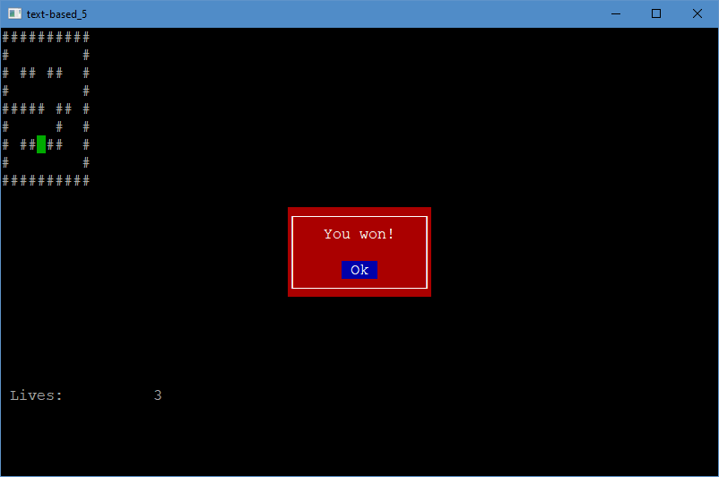
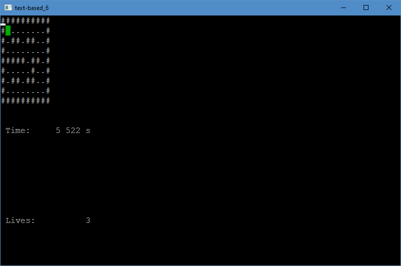

# hb-games

<h1><p align="center">
Text-based game development
</p></h1>

<p align="justify">
This guide is an introduction to game programming using the Harbour programming language. It covers the basics of text-based game development, including techniques for displaying text on the screen, handling user input, and creating a game loop. We will also provide simple examples of text-based games that you can use as a starting point for your own projects. Whether you're a beginner or an experienced developer, this instruction will help you learn the essential concepts and skills needed to create your own text-based games using Harbour.
</p>

Creating a text-based game in Harbour is a process that typically involves the following steps:

<ul>
<li>
<p align="justify">
Designing the game: The first step in creating a text-based game is to design the game mechanics,
story, and characters. This includes creating a detailed game map, outlining the main quest and any subplots,
and deciding on the types of characters and enemies that will appear in the game.
</p>
</li>

<li>
<p align="justify">
Writing the game logic: Once the game design is complete, you can begin writing the code that will control the game logic.
This includes creating functions to handle player input, update the game state, and display text on the screen.
</p>
</li>

<li>
<p align="justify">
Building the game world: With the game logic in place, you can start building the game world by creating locations,
characters, items, and enemies. This is where you will use Harbour's database functionality to create and manipulate the game data.
</p>
</li>

<li>
<p align="justify">
Adding interaction: At this stage, you can add interactivity to the game by creating dialogues, puzzles, and other types of interactions
that will make the game more engaging for the player. This step also includes user input handling, conditional statements and error management.
</p>
</li>

<li>
<p align="justify">
Testing and debugging: Once the game is complete, it's important to test it thoroughly and fix any bugs or issues that are discovered.
This process involves running the game and playing through it, testing all aspects of the game mechanics, and fixing any errors or crashes that occur.
</p>
</li>

<li>
<p align="justify">
Release and maintenance: After all the steps are done, your game is ready to be distributed and shared. Ongoing maintenance will be necessary to fix
any issue that might arise during the use of the game.
</p>
</li>
</ul>

<p align="justify">
Creating a text-based game can be a fun and rewarding process, but it also requires a significant amount of planning and programming. With Harbour's
powerful set of libraries and functions, as well as its compatibility with existing xBase code, it can make the process of creating a text-based game
a bit easier.
</p>

<p align="justify">
Those are the general steps involved in creating a text-based game using the Harbour programming language, but there may be additional steps or
considerations depending on the specific requirements and complexity of the game you're trying to create. Some other things to keep in mind include:
</p>

<ul>
<li>
Improving the user interface, like adding a menu, color options, and other elements to improve the overall look and feel of the game.
</li>
<li>
Adding sound effects and music to enhance the gaming experience.
</li>
<li>
Adding a save feature, so players can save their progress and continue playing later on.
</li>
<li>
Optimizing the performance of the game, in case the game is too slow or too resource intensive.
</li>
<li>
Integrating different platforms, like a web or mobile versions of the game.
</li>
<li>
Creating a public version of the game and providing support to end-users
</li>
</ul>

<p align="justify">
Creating a text-based game is a challenging but very rewarding process. It requires a good deal of creativity and problem-solving skills.
The Harbour programming language offers a powerful set of libraries and functions that can help to make this process easier, but it's important
to keep in mind that game development takes time, effort and a lot of testing to get it right.
</p>

## Handling user input

<p align="justify">
Handling user input is an important aspect of creating a text-based game using the Harbour programming language. There are several techniques that you can use to handle user input, such as:
</p>

<ul>
<li>
<p align="justify">
Keyboard input: One of the most basic ways to handle user input is to use the keyboard. Harbour provides several built-in functions, such as GET and <b>Inkey</b>, that can be used to capture and process keyboard input.
</p>
</li>

<li>
<p align="justify">
Menus: Menus can be used to provide the player with a list of options to choose from. Menus can be implemented using loops and conditional statements, and can be navigated using the keyboard or other input methods.
</p>
</li>

<li>
<p align="justify">
Parsing input: Another technique is to allow the player to type in commands, and then use the Harbour's string manipulation functions to parse the input and determine the appropriate action to take.
</p>
</li>

<li>
<p align="justify">
Creating a dialog interface: You can also use a dialog box to handle user input, where the player can interact with the game by clicking on buttons, input fields and other widgets, this can be achieved using the built-in GUI libraries and functions of Harbour.
</p>
</li>

<li>
<p align="justify">
Input validation: It's important to validate input to ensure that it is in the correct format and within the expected range. This can be done using conditional statements and error management.
</p>
</li>

<li>
<p align="justify">
Shortcut commands: You can create shortcut commands that the user can input to perform specific actions, this can make the gameplay experience more convenient.
</p>
</li>
</ul>

<p align="justify">
All these techniques can be used in conjunction with each other and can be chosen depending on the game's requirements, for example a RPG game could use a menu system to handle the player's movement, a dialog box for NPC interactions and commands for specific actions.
</p>

<p align="justify">
Keep in mind that it's important to handle user input in a way that is intuitive and easy for the player to understand, and to provide clear feedback when the input is processed.
</p>

## Creating a game loop

<p align="justify">
A game loop is a fundamental concept in game programming that is used to control the flow of the game and update the game state. The game loop is typically implemented as a continuous loop that runs until the game is over. In a text-based game created with Harbour, the game loop typically involves the following steps:
</p>

<ul>
<li>
<p align="justify">
Input handling: The first step in the game loop is to handle user input. This includes capturing input from the keyboard, mouse, or other input devices, and determining the appropriate action to take based on the input.
</p>
</li>

<li>
<p align="justify">
Updating the game state: Once input is handled, the game state is updated. This includes updating the positions of characters and objects, checking for collisions, and determining if the game is over.
</p>
</li>

<li>
<p align="justify">
Displaying the game state: After the game state is updated, it is displayed on the screen. This typically involves displaying text and other visual elements, such as images, to the player.
</p>
</li>

<li>
<p align="justify">
Checking for game over: After the game state is displayed, the game loop checks if the game is over. This could be done by checking if the player reached a certain goal, if a game over condition has been met, or if the player decided to quit the game.
</p>
</li>

<li>
<p align="justify">
Loop: If the game is not over, the game loop repeats, starting with the input handling step, and continuing through the other steps of the loop.
</p>
</li>

<li>
<p align="justify">
End of the game: If the game is over, the game loop exits and the game is closed.
</p>
</li>
</ul>

<p align="justify">
It's important to note that the game loop does not have to be a infinite loop, a game loop can have a set number of iterations or until a specific condition is met. Also the loop could have some sleep time to reduce the CPU usage.
</p>

<p align="justify">
It's also important to keep in mind that the game loop should be optimized for performance, as it is executed repeatedly and any performance bottlenecks
</p>

## Simple examples of text-based games

> - [text-based_1.prg](Text-based-game-development/text-based_1.prg)

``` harbour
#include "inkey.ch"

PROCEDURE Main()

   LOCAL nKey, aMap, nPlayerX, nPlayerY

   aMap := { ;
      { "#", "#", "#", "#", "#", "#", "#", "#", "#", "#" }, ;
      { "#", ".", ".", ".", ".", ".", ".", ".", ".", "#" }, ;
      { "#", ".", "#", "#", ".", "#", "#", ".", ".", "#" }, ;
      { "#", ".", ".", ".", ".", ".", ".", ".", ".", "#" }, ;
      { "#", "#", "#", "#", "#", ".", "#", "#", ".", "#" }, ;
      { "#", ".", ".", ".", ".", ".", "#", ".", ".", "#" }, ;
      { "#", ".", "#", "#", ".", "#", "#", ".", ".", "#" }, ;
      { "#", ".", ".", ".", ".", ".", ".", ".", ".", "#" }, ;
      { "#", "#", "#", "#", "#", "#", "#", "#", "#", "#" } }

   nPlayerX := 2
   nPlayerY := 2

   WHILE( .T. )

      DrawMap( aMap, nPlayerX, nPlayerY )

      nKey := Inkey( 1 )

      IF nKey == K_UP
         nPlayerY := nPlayerY - 1
      ELSEIF nKey == K_DOWN
         nPlayerY := nPlayerY + 1
      ELSEIF nKey == K_LEFT
         nPlayerX := nPlayerX - 1
      ELSEIF nKey == K_RIGHT
         nPlayerX := nPlayerX + 1
      ENDIF
   ENDDO

   RETURN

FUNCTION DrawMap( aMap, nPlayerX, nPlayerY )

   LOCAL nX, nY

   FOR nY := 1 TO Len( aMap )
      FOR nX := 1 TO Len( aMap[ nY ] )
         IF nX == nPlayerX .AND. nY == nPlayerY
            hb_DispOutAt( nY - 1, nX - 1, "P", 0x22 )
         ELSE
            hb_DispOutAt( nY - 1, nX - 1, aMap[ nY ][ nX ], 0x7 )
         ENDIF
      NEXT
   NEXT

   RETURN NIL
```



<p align="justify">
This code is a simple text-based game written in the Harbour programming language. The game uses an array, <b>aMap</b>, to represent the map of the game world, and assigns characters to different positions on the map to represent different types of locations (e.g. walls represented by "#" and open spaces represented by "." ). The player's position is tracked using the variables <b>nPlayerX</b> and <b>nPlayerY</b>, which are initially set to 2,2.
</p>
<p align="justify">
The game loop is implemented in the while loop, that iterates continuously until the game is over. The game loop calls the function DrawMap, that takes the map, player's x and y position as inputs. Inside the function, the map is looped through, and the characters of the array are printed on the screen using <b>hb_DispOutAt()</b> function, using x and y positions as the coordinates for printing. If the current position is the player's position, a special character is printed.
</p>

<p align="justify">
The game loop also captures input from the keyboard using the <b>Inkey</b> function, which waits for 1 second for an input. If an input is captured, the program checks if it is an arrow key and updates the player's position accordingly.
</p>

<p align="justify">
The game allows the player to move on the map using the arrow keys, and the player character is represented by a special character.
</p>

> - [text-based_2.prg](Text-based-game-development/text-based_2.prg)

``` harbour
#include "inkey.ch"

PROCEDURE Main()

   LOCAL nKey, aMap, nPlayerX, nPlayerY, nLives

   aMap := { ;
      { "#", "#", "#", "#", "#", "#", "#", "#", "#", "#" }, ;
      { "#", ".", ".", ".", ".", ".", ".", ".", ".", "#" }, ;
      { "#", ".", "#", "#", ".", "#", "#", ".", ".", "#" }, ;
      { "#", ".", ".", ".", ".", ".", ".", ".", ".", "#" }, ;
      { "#", "#", "#", "#", "#", ".", "#", "#", ".", "#" }, ;
      { "#", ".", ".", ".", ".", ".", "#", ".", ".", "#" }, ;
      { "#", ".", "#", "#", ".", "#", "#", ".", ".", "#" }, ;
      { "#", ".", ".", ".", ".", ".", ".", ".", ".", "#" }, ;
      { "#", "#", "#", "#", "#", "#", "#", "#", "#", "#" } }

   nPlayerX := 2
   nPlayerY := 2
   nLives := 3

   WHILE( nLives > 0 )

      DrawMap( aMap, nPlayerX, nPlayerY )

      hb_DispOutAt( 20, 1, "Lives: " + Str( nLives ) )

      nKey := Inkey( 1 )

      IF nKey == K_UP
         IF aMap[ nPlayerY - 1 ][ nPlayerX ] == "#"
            nLives -= 1
            hb_DispOutAt( 22, 1, "You hit a wall, you lost 1 life" )
         ELSE
            nPlayerY := nPlayerY - 1
         ENDIF
      ELSEIF nKey == K_DOWN
         IF aMap[ nPlayerY + 1 ][ nPlayerX ] == "#"
            nLives -= 1
            hb_DispOutAt( 22, 1, "You hit a wall, you lost 1 life" )
         ELSE
            nPlayerY := nPlayerY + 1
         ENDIF
      ELSEIF nKey == K_LEFT
         IF aMap[ nPlayerY ][ nPlayerX - 1 ] == "#"
            nLives -= 1
            hb_DispOutAt( 22, 1, "You hit a wall, you lost 1 life" )
         ELSE
            nPlayerX := nPlayerX - 1
         ENDIF
      ELSEIF nKey == K_RIGHT
         IF aMap[ nPlayerY ][ nPlayerX + 1 ] == "#"
            nLives -= 1
            hb_DispOutAt( 22, 1, "You hit a wall, you lost 1 life" )
         ELSE
            nPlayerX := nPlayerX + 1
         ENDIF
      ENDIF
   ENDDO

   IF nLives == 0
      Alert( "Game Over!" )
   ENDIF

   RETURN

FUNCTION DrawMap( aMap, nPlayerX, nPlayerY )

   LOCAL nX, nY

   FOR nY := 1 TO Len( aMap )
      FOR nX := 1 TO Len( aMap[ nY ] )
         IF nX == nPlayerX .AND. nY == nPlayerY
            hb_DispOutAt( nY - 1, nX - 1, "P", 0x22 )
         ELSE
            hb_DispOutAt( nY - 1, nX - 1, aMap[ nY ][ nX ], 0x7 )
         ENDIF
      NEXT
   NEXT

   RETURN NIL
```



<p align="justify">
With this code, the game will display the number of lives that the player has left and it will end the game when the player loses all lives. The player will lose 1 live every time he hits a wall and the game over message will be shown. It's important to note that the code is a simple example of how you could implement a text-based game using Harbour, it has limitations and could be improved to make it more interesting, complex and fun!
</p>

<p align="justify">
By enlarging the <b>aMap</b> array, you can create larger and more complex levels for the game, making it more interesting and challenging for the player.
</p>

<p align="justify">
You can add a check within the movement logic, when the player moves to a new position, check if the character is on a "." <b>If</b> it is, then you can remove it from the game board. One way to do this is to change the <b>"."</b> to a blank space <b>" "</b> or another character that represents an empty space. For example, you can add this check within the <b>ELSE</b> block of the movement logic:
</p>

> - [text-based_3.prg](Text-based-game-development/text-based_3.prg)

``` harbour
WHILE( nLives > 0 )

   DrawMap( aMap, nPlayerX, nPlayerY )

   hb_DispOutAt( 20, 1, "Lives: " + Str( nLives ) )

   nKey := Inkey( 1 )

   IF nKey == K_UP
      IF aMap[ nPlayerY - 1 ][ nPlayerX ] == "#"
         nLives -= 1
         hb_DispOutAt( 22, 1, "You hit a wall, you lost 1 life" )
      ELSE
         nPlayerY := nPlayerY - 1
      ENDIF
   ELSEIF nKey == K_DOWN
      IF aMap[ nPlayerY + 1 ][ nPlayerX ] == "#"
         nLives -= 1
         hb_DispOutAt( 22, 1, "You hit a wall, you lost 1 life" )
      ELSE
         nPlayerY := nPlayerY + 1
      ENDIF
   ELSEIF nKey == K_LEFT
      IF aMap[ nPlayerY ][ nPlayerX - 1 ] == "#"
         nLives -= 1
         hb_DispOutAt( 22, 1, "You hit a wall, you lost 1 life" )
      ELSE
         nPlayerX := nPlayerX - 1
      ENDIF
   ELSEIF nKey == K_RIGHT
      IF aMap[ nPlayerY ][ nPlayerX + 1 ] == "#"
         nLives -= 1
         hb_DispOutAt( 22, 1, "You hit a wall, you lost 1 life" )
      ELSE
         nPlayerX := nPlayerX + 1
      ENDIF
   ENDIF

   IF aMap[ nPlayerY ][ nPlayerX ] == "."
      aMap[ nPlayerY ][ nPlayerX ] := " "
   ENDIF

ENDDO
```

<p align="justify">
You would need to make a similar modification in the <b>DrawMap()</b> function so that it knows how to draw the blank space or other character you choose to represent an empty space.
</p>

<p align="justify">
To remove a <b>.</b> from the game board when the player character moves through it, you can add a check in the code that updates the player's position. For example, you can add the following code after updating the player's position:
</p>

``` harbour
IF aMap[ nPlayerY ][ nPlayerX ] == "."
   aMap[ nPlayerY ][ nPlayerX ] := " "
ENDIF
```

<p align="justify">
This checks if the player's current position is a <b>.</b>, and if it is, it changes it to a space character <b>" "</b>. This effectively removes the <b>.</b> from the game board.
</p>

<p align="justify">
You can add this check in each of the four <b>ELSE</b> blocks that update the player's position, depending on the key pressed.
</p>

<p align="justify">
<b>aMap</b> and <b>nPlayerX</b> and <b>nPlayerY</b> which represent the current position of the player on the game board. The function uses nested for loops to iterate through each element of the <b>aMap</b> array, and for each element it checks if the current coordinates match the player's coordinates. If they match, it outputs the player character <b>"P"</b> with a specific color code 0x22. If the current element is a <b>"."</b> it will output an empty space <b>" "</b> with color code 0x7. Else, it will output the element with color code 0x7. It then returns <b>NIL</b>. This function is used to update the game board with the player's current position and display any changes made to the board.
</p>

``` harbour
FUNCTION DrawMap( aMap, nPlayerX, nPlayerY )
   LOCAL nX, nY
   FOR nY := 1 TO Len( aMap )
      FOR nX := 1 TO Len( aMap[ nY ] )
         IF nX == nPlayerX .AND. nY == nPlayerY
            hb_DispOutAt( nY - 1, nX - 1, "P", 0x22 )
         ELSE
            IF aMap[ nY ][ nX ] == "." .AND. nX == nPlayerX .AND. nY == nPlayerY
               hb_DispOutAt( nY - 1, nX - 1, " ", 0x7 )
            ELSE
               hb_DispOutAt( nY - 1, nX - 1, aMap[ nY ][ nX ], 0x7 )
            ENDIF
         ENDIF
      NEXT
   NEXT
   RETURN NIL
```

<p align="justify">
Regarding the <b>DrawMap</b> function, the changes were made to the way the map is displayed. The previous version of the function used <b>hb_DispOutAt()</b> to display each element of the map one by one at its corresponding position on the screen. The new version of the function makes use of an <b>IIF</b> statement to check if the current element of the map is a dot <b>(.)</b>, and if it is, it will replace it with a blank space <b>( )</b>. This is done so that the dots are not permanently removed from the map after the player has passed over them.
</p>



<p align="justify">
It is important to note that this is just one possible way to implement this feature, and you may want to adjust it to suit the needs of your specific game.
<p>

<p align="justify">
<b>​hb_MilliSeconds()</b> function to get the current time in milliseconds, and then compare it to a time limit. You can add a variable <b>nStartTime</b> to your code to store the starting time, and then check if the current time minus the start time is greater than your time limit. Here's an example of how you can add a time limit of 60 seconds to your code:
</p>

> - [text-based_4.prg](Text-based-game-development/text-based_4.prg)


``` harbour
PROCEDURE Main()

   LOCAL nKey, aMap, nPlayerX, nPlayerY, nLives, nStartTime, nTimeLimit

   aMap := { /* map */ }
   nPlayerX := 2
   nPlayerY := 2
   nLives := 3
   nTimeLimit := 30000 // 60 seconds in milliseconds

   nStartTime := hb_MilliSeconds()

   WHILE( nLives > 0 )

      DrawMap( aMap, nPlayerX, nPlayerY )
      hb_DispOutAt( 20, 1, "Lives: " + Str( nLives ) )

      nKey := Inkey( 1 )

      /* move player */

      IF aMap[ nPlayerY ][ nPlayerX ] == "."
         aMap[ nPlayerY ][ nPlayerX ] := " "
      ENDIF

      /* check time limit */
      IF hb_MilliSeconds() - nStartTime > nTimeLimit
         Alert("Time's up!")
         nLives := 0
      ENDIF

   ENDDO

   IF nLives == 0
      Alert( "Game Over!" )
   ENDIF

   RETURN

FUNCTION DrawMap( aMap, nPlayerX, nPlayerY )
   /* ... */
   RETURN NIL
```

<p align="justify">
It's important to note that the above code snippet is just an example and you may need to adjust it to fit the specific requirements of your game.
</p>



<p align="justify">
Here's an example of how you could modify the existing code to add a timer for the player and end the game after all dots have been collected:
</b>

> - [text-based_5.prg](Text-based-game-development/text-based_5.prg)

``` harbour
LOCAL nStartTime, nDotsRemaining

nStartTime := hb_MilliSeconds()
nDotsRemaining := CountDots( aMap )

WHILE( nLives > 0 )

   IF aMap[ nPlayerY ][ nPlayerX ] == "."
      aMap[ nPlayerY ][ nPlayerX ] := " "
      nDotsRemaining -= 1
   ENDIF

   IF nDotsRemaining == 0
      Alert( "You won!" )
      EXIT
   ENDIF

   IF hb_MilliSeconds() - nStartTime > 30000
      Alert( "Time's up!" )
      EXIT
   ENDIF

ENDDO

FUNCTION CountDots( aMap )

   LOCAL nDots, nX, nY

   nDots := 0
   FOR nY := 1 TO Len( aMap )
      FOR nX := 1 TO Len( aMap[ nY ] )
         IF aMap[ nY ][ nX ] == "."
            nDots += 1
         ENDIF
      NEXT
   NEXT

   RETURN nDots
```

<p align="justify">
You can adjust the time limit to any value you want by changing the number in <b>hb_MilliSeconds() - nStartTime > 30000</b> to the number of milliseconds you want the limit to be.
</p>

<p align="justify">
The code you've provided keeps track of the time it takes the player to collect all the dots on the map by using the <b>hb_Milliseconds()</b> function to get the current time when the game starts, and then again after all the dots have been collected. The difference between these two times is the total time it took the player to collect all the dots, which is then displayed to the player using the <>hb_DispOutAt()</b> function.
The game will end after the player collects all the dots.
</p>

<p align="justify">
The modified code includes a timer that starts when the game begins and lasts for 30 seconds. The game ends either when the player collects all the dots, or when the time runs out. The code includes a new variable, <b>nStartTime</b>, that keeps track of the starting time of the game using the <b>hb_MilliSeconds()</b> function. The <b>nDotsRemaining</b> variable keeps track of the number of dots remaining on the map. This is used to check if all the dots have been collected and the game should end. Inside the main game loop, an additional check is added to see if the time has run out, and if so, the game will end with a message "Time's up!". Additionally, a new function <b>CountDots()</b> is added, which counts the number of dots in the map.
</p>

<p align="justify">
At the end of this example, we make some changes to the code:
</p>

``` harbour
LOCAL nKey, aMap, nPlayerX, nPlayerY, nLives, lQuit := .F., nStartTime, nDotsRemaining

/* ... */

   WHILE( nLives > 0 .AND. ! lQuit )

/* ... */

      IF nDotsRemaining == 0
         DrawMap( aMap, nPlayerX, nPlayerY )
         Alert( "You won!" )
         lQuit := .T.
      ENDIF

/* ... */
```

<p align="justify">
This creates a new local variable named lQuit which is initially set to false. The <b>WHILE</b> loop that controls the game logic now also checks if <b>lQuit</b> is true in addition to checking if the player has any remaining lives. When the player collects all the dots, the code will set <b>lQuit</b> to true and the game will exit the <b>WHILE</b> loop.
</p>

<p align="justify">
In this way, the code will run the <b>DrawMap()</b> function one last time, to show the player where they are in the map, when they collect all the dots.
</p>



<p align="justify">
You can use the <b>hb_DispOutAt()</b> function to display the elapsed time in the game. You can do this by first creating a variable to store the start time of the game, and then, inside the while loop, you can calculate the elapsed time by subtracting the start time from the current time using the <b>hb_MilliSeconds()</b> function. Finally, you can use the hb_DispOutAt() function to display the elapsed time on the screen. Here is an example of how you can do this:
</p>

``` harbour
LOCAL nKey, aMap, nPlayerX, nPlayerY, nLives, lQuit := .F., nStartTime, nDotsRemaining, nElapsedTime

/* ... */

nStartTime := hb_MilliSeconds()

/* ... */

WHILE( nLives > 0 .AND. ! lQuit )

/* ... */

nElapsedTime := hb_MilliSeconds() - nStartTime
hb_DispOutAt( 11, 1, "Time: " +  Transform( nElapsedTime, "9,999 999" ) + " s" )

/* ... */
```
<p align="justify">
In this example, the variable <b>nElapsedTime</b> is used to store the elapsed time in the game, which is calculated by subtracting the start time from the current time using the <>hb_MilliSeconds()</b> function. The elapsed time is then displayed on the screen using the <b>hb_DispOutAt()</b> function. This will allow the player to see how much time is left during the game.
</p>



<p align="justify">
Summary, in this code, we created a simple game where the player's task is to collect all the dots <b>"."</b> from the player board. The player is controlled using the arrow keys and the game ends either when the player collects all the dots or runs out of lives. The game also has a time limit of 30 seconds, after which the game will end. The code uses a two-dimensional array to represent the game board, and the array elements are displayed on the screen using the <b>hb_DispOutAt()</b> function. The player's position is represented by two variables, <b>nPlayerX</b> and <b>nPlayerY</b>, and the player's lives are represented by the variable nLives. The player's movement is controlled by the <b>Inkey()</b> function, which reads the arrow keys pressed by the player. The game also displays the elapsed time and the remaining lives on the screen. The game also checks if the player has collected all the dots, and if so, the game ends with a message <b>"You wo!"</b>
</p>

--------------------------------------------------------------------------------

<p align="justify">
Here are a few examples of changes that could be made to the game:
</p>

<ul>
<li>
Adding a scoring system, where the player earns points for collecting dots and loses points for hitting walls.
</li>

<li>
Adding power-ups, such as extra lives or a temporary invincibility mode.
</li>

<li>
Adding enemies that move around the map and must be avoided.
</li>

<li>
Adding multiple levels, with different maps and increasing difficulty.
</li>

<li>
Adding a pause feature, allowing the player to pause the game and resume it later.
</li>

<li>
Adding a high scores list, displaying the top scores achieved by players.
</li>

<li>
Adding sound effects and background music to enhance the game's atmosphere.
</li>

<li>
Adding a two-player mode, where two players can play on the same keyboard.
</li>

<li>
Adding a feature to customize the appearance of the player character.
</li>

<li>
Adding a time limit for the game, and the game will end if the player does not complete the level within a certain time.
</li>
</ul>

--------------------------------------------------------------------------------

<a href="https://www.paypal.me/rafaljopek?locale.x=pl_PL/">If you enjoyed this instruction, please support the project by making a donation through Paypal.<br> Your support will help to ensure that this instruction can continue to be developed and updated.</a>

--------------------------------------------------------------------------------

<p align="center">
"Copyright 2017-2023 Rafał Jopek"
</p>

<p align="center">
<a href="https://harbour.pl/">harbour.pl</a>
</p>

