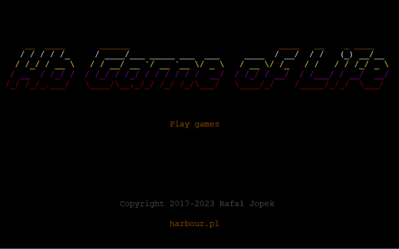

# hb-life

Cellular automata were originally introduced by [John von Neumann](https://en.wikipedia.org/wiki/John_von_Neumann) and
[Stanisław Ulam](https://en.wikipedia.org/wiki/Stanislaw_Ulam) as a possible idealization of biological systems, with the
particular purpose of modeling biological self-reproduction. Since then CAs have been reinvented several times under various
names such as "cellular spaces," "tessellation automata," "cellular structures," "cellular spaces" and "iterative arrays".
During the last two decades CAs have been extensively used as mathematical idealizations of physical systems in which space...

Conway's Game of Life is a cellular automaton simulation game that was created by mathematician John Horton Conway in 1970.
The game is played on a grid of cells, where each cell can be in one of two states: alive or dead.
The game follows a set of rules that determine how the state of each cell changes from one generation to the next.

The rules of Conway's Game of Life are as follows:

1. Any live cell with fewer than two live neighbors dies, as if by underpopulation.
2. Any live cell with two or three live neighbors lives on to the next generation.
3. Any live cell with more than three live neighbors dies, as if by overpopulation.
4. Any dead cell with exactly three live neighbors becomes a live cell, as if by reproduction.

These rules are applied to each cell in the grid simultaneously, based on the state of its neighbors in the previous generation.
The game continues to evolve according to these rules until a stable state is reached, or until the player decides to stop the simulation.

Conway's Game of Life is a simple but fascinating game that has inspired many variations and has been the subject of much research and analysis. It is often used as a demonstration of emergent behavior and self-organization in complex systems.

The Game of Life is a classic computer science game that starts with a welcome screen.
When you press Enter, you will be taken to the second screen where you can select the initial configuration using your mouse.
Click the left mouse button to place pieces on the grid and the right mouse button to remove them.
Once you are satisfied with your configuration, press the space key to start the game.
The game will then run according to the B3/S23 rule: a cell will be born if it has exactly three neighbors, and a cell will survive if it has exactly two or three eighbors.

Enjoy!

